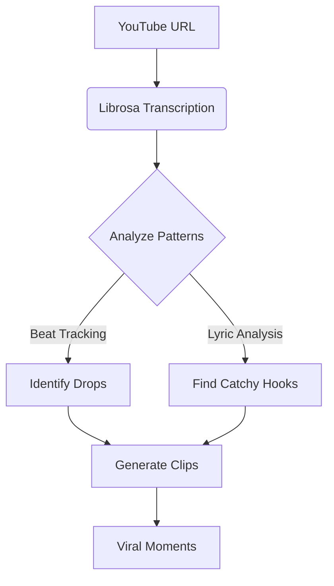

<h1 align="center">JumpCut</h1>

<p align="center"> A Music Streaming App for Gen Z's Attention Span </p>

<p align="center">
   
</p>

<p align="center">
    
    
    
</p>

<p align="center"><strong>Using AI, JumpCut serves the "trendiest" parts of songs, so you don't have to sit through the boring bit when you're vibing with your imaginary friends.</strong></p>

---

## ✨ Features

- 🎤 **AI-Powered Analysis** powered by Librosa
- 🎯 **Precision Cutting** identifies the most viral-ready segments  
- ⚡ **Lightning Fast** processing with parallel audio analysis  
- 🥁 **Enhanced Drop Detection** using chroma features and adaptive thresholding  
- 🔍 **Adaptive Thresholding** to find trendy segments with prominence-based peak detection  
- 🚀 **Seamless Silence Removal** for smooth audio transitions  

---

## 🛠️ Installation

```bash
git clone https://github.com/kuberwastaken/JumpCut.git
cd JumpCut
```
- Create a new virtual environment
```bash
python -m venv jumpcut
```
```bash
source jumpcut/bin/activate  
# Windows: jumpcut\Scripts\activate
```
- install requirements
```bash
pip install -r requirements.txt
```

### 🚀 Usage
Run the app:

```bash
python src/app.py
```

- Paste YouTube Music links to the front end 

- Sip your coffee 

- Get the best parts

## 🧠 How It Works



## 📦 Project Structure

```bash
JumpCut/
├── src/
│   ├── app.py                # Main application flow
│   ├── audio_processing.py   # AI-powered audio processing
├── samples/                  # Pre-processed viral clips
├── requirements.txt          # Dependencies
└── config.env                # API keys (gitignored)
```

## 📌 Dependencies

- `librosa` - Library for audio manipulation
- `pytube` - YouTube audio extraction
- `numpy` - Audio waveform processing
- `python-dotenv` - Environment management

---

⚠️ **Alpha Warning**  
JumpCut 2.0 is in active development. Found a bug? Report it [here](https://github.com/kuberwastaken/JumpCut/issues).


